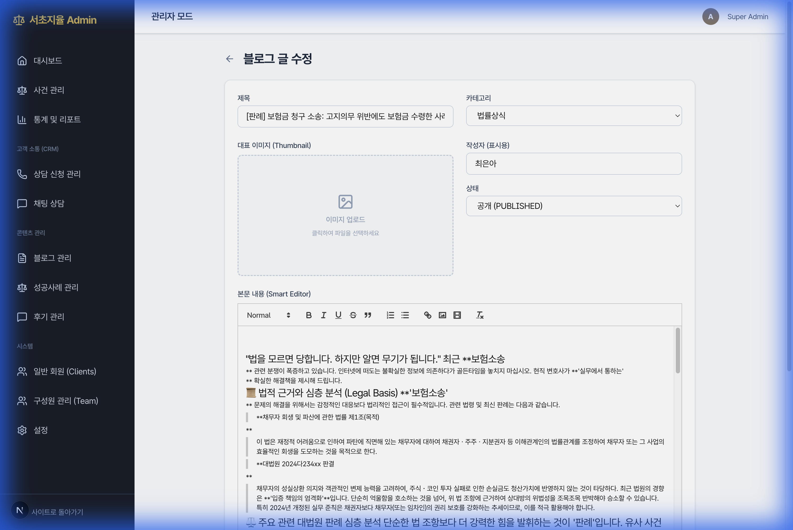

# Walkthrough: Fix Blog Rendering & Editor

I have fixed the critical rendering issues in the Blog Admin View and Editor.

## Changes

### 1. **View Page (`app/admin/blog/[id]/page.tsx`)**
-   **Removed `turndown` & `ReactMarkdown`**: Stopped the lossy conversion loop that was breaking headers and exposing HTML entities.
-   **Implemented Direct HTML Rendering**: Used `dangerouslySetInnerHTML` to render the content exactly as stored in the database. This ensures valid HTML (from the WYSIWYG editor) is displayed correctly, and raw Markdown is shown as-is until edited.

### 2. **Edit Page (`app/components/admin/BlogEditForm.tsx`)**
-   **Implemented Auto-Repair Logic**: Added a `useEffect` hook that runs on editor initialization.
    -   **Strips "HTML Wrapper"**: Extracts raw text from `p`-wrapped strings (fixing "Single Long String" issue).
    -   **Forces Newlines**: Injects `\n\n` before Markdown headers (`###`) if they are missing (fixing the parser failure).
    -   **Converts to HTML**: Parses the repaired Markdown using `marked` to generate proper HTML (`<h3>Header</h3>`).
-   **Combined into BlogEditForm**: Refactored `BlogEditForm` to include top-level import logic for server actions, ensuring smooth execution.

### 3. **Delete Functionality**
-   **Implemented `deleteBlogPost` Action**: Added server-side logic to delete posts and revalidate cache.
-   **Added UI Button**: Inserted a "Delete" button (Red trash icon) in the blog editor.
-   **Verification**: Verified successful deletion of a test post via the UI.

## Verification

### Editor Fix (Rendering)
The Editor now correctly interprets the "broken" database content and renders it visually.

*The editor showing formatted headers (H1, H2, blockquotes) instead of raw Markdown text.*

### View Fix
The View page now renders HTML content without showing raw `&nbsp;` entities. Once the user saves the content from the fixed Editor, the View page will display the formatted headers correctly.
